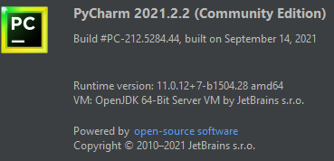
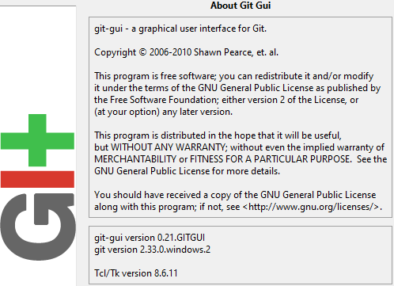

# **Teads Auction with test data**
## Infrastructure:
### GitHub Repository:
[https://github.com/ironchamp/journey.git](GitHub repo)
### Tool versions:
    Python 3.9.7 (for Windows)
    PyCharm 2021.2.2 (Windows Community Edition)

    git version 2.33.0.windows.2
    Git bash for Windows v2.33.0(2)
    git-gui version 0.2.GITGUI

## Files:
    `auction.py`: (Python script with algorithm)
        imports all auction sales and used to determine buyer and price to pay for an individual auction
    `bids.json`: (JSON-formatted auction sales test data)
        contains complete test data for all auction sales (in JSON format)
    `main.py`: (Python script for execution)
        effects a series of auction sales to show winning bidders with prices for each sale item 
## Results:
### INFO logging
#### default mode, showing results only
#### tests driven by `main.py`:
    Test case 1a:
        Winner of item, 'x' (from P) is E at €130 (after 9 bids)
    Test case 1b:
        Winner of item, 'xx' (from P) is E at €136 (after 10 bids)
    Test case 2:
        Winner of item, 'y' (from Q) is A at €150 (after 2 bids)
    Test case 3:
        Unsold item, 'z' (from R) since all 2 bids below reserve (€250)
### DEBUG logging
#### detailed tracking mode, showing complementary input data & flow logic
#### switched within `auction.py`:
        {'item': 'x', 'reserve': 100, 'seller': 'P'}
            Reserved price for 'x' is 100
        [('x', 110, 'A'), ('x', 130, 'A'), ('x', 125, 'C'), ('x', 105, 'D'), ('x', 115, 'D'), ('x', 90, 'D'), ('x', 132, 'E'), ('x', 135, 'E'), ('x', 140, 'E')]
            New winner A increased €100
            Same winner A unchanged at €100 (pending €130 possible)
            Same winner A increased to €125 (as offered by C)
            No impact from D because €105 is below the current €130 price
            No impact from D because €115 is below the current €130 price
            No impact from D because €90 is below the current €130 price
            New winner E increased €130
            Same winner E unchanged at €130 (pending €135 possible)
            Same winner E unchanged at €130 (pending €140 possible)

        {'item': 'xx', 'reserve': 100, 'seller': 'P'}
            Reserved price for 'xx' is 100
        [('xx', 110, 'A'), ('xx', 130, 'A'), ('xx', 125, 'C'), ('xx', 105, 'D'), ('xx', 115, 'D'), ('xx', 90, 'D'), ('xx', 132, 'E'), ('xx', 135, 'E'), ('xx', 140, 'E'), ('xx', 136, 'F')]
            New winner A increased €100
            Same winner A unchanged at €100 (pending €130 possible)
            Same winner A increased to €125 (as offered by C)
            No impact from D because €105 is below the current €130 price
            No impact from D because €115 is below the current €130 price
            No impact from D because €90 is below the current €130 price
            New winner E increased €130
            Same winner E unchanged at €130 (pending €135 possible)
            Same winner E unchanged at €130 (pending €140 possible)
            Same winner E increased to €136 (as offered by F)
        
        {'item': 'y', 'reserve': 150, 'seller': 'Q'}
            Reserved price for 'y' is 150
        [('y', 160, 'A'), ('y', 140, 'E')]
            New winner A increased €150
            No impact from E because €140 is below the current €160 price
        
        {'item': 'z', 'reserve': 250, 'seller': 'R'}
            Reserved price for 'z' is 250
        [('z', 200, 'B'), ('z', 180, 'D')]
            Same winner  increased to €200 (as offered by B)
            No impact from D because €180 is below the current €250 price
